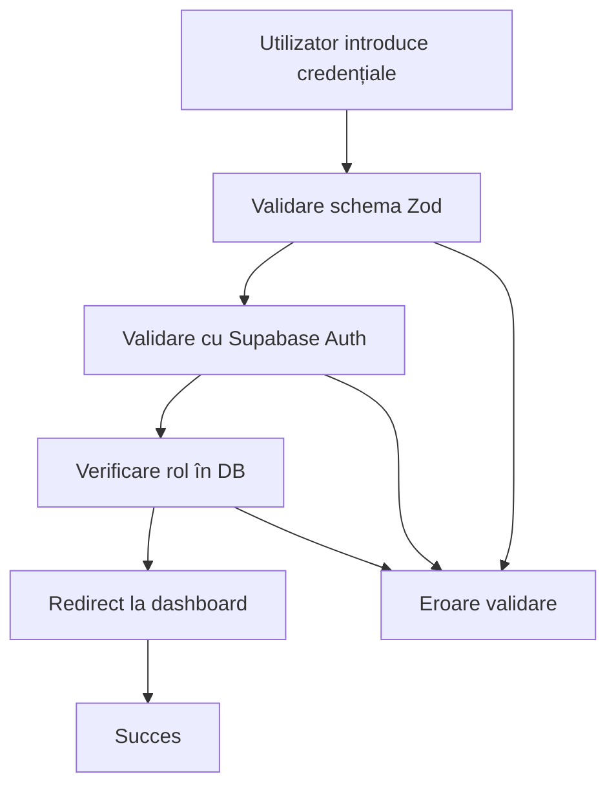

# Domeniul Auth

Domeniul `auth` gestionează autentificarea și autorizarea utilizatorilor în aplicația de salon, inclusiv procesele de login, setare parolă și gestionarea rolurilor.

## 🎯 Business Case

Domeniul auth se ocupă de:

- **Autentificarea utilizatorilor** cu email și parolă
- **Gestionarea rolurilor** (admin, stylist) pentru autorizare
- **Setarea parolelor** pentru utilizatori noi (invitați)
- **Deconectarea** utilizatorilor
- **Verificarea permisiunilor** pe baza rolurilor

## 📋 Funcționalitate

### Pentru Toți Utilizatorii

- ✅ Autentificare cu email și parolă
- ✅ Setare parolă pentru conturi noi
- ✅ Deconectare din aplicație
- ✅ Verificare roluri pentru autorizare

### Pentru Administratori

- ✅ Gestionarea utilizatorilor prin Supabase Admin API
- ✅ Căutarea utilizatorilor după email
- ✅ Verificarea rolurilor din baza de date

## 🗂️ Structura Fișierelor

```
src/core/domains/auth/
├── auth.types.ts              # Tipuri TypeScript + interfaces
├── auth.constants.ts          # Constante + mesaje + configurări
├── auth.validators.ts         # Validatori Zod + helpers
├── auth.repository.ts         # Acces la baza de date + Supabase Admin
├── auth.service.ts            # Business logic
├── index.ts                   # Export centralizat
└── README.md                  # Documentația domeniului

src/features/auth/
└── actions.ts                 # Server Actions (Next.js)
```

## 🔧 Utilizare

### 1. Import

```typescript
import { createAuthService, createAuthRepository, type SignInData, AUTH_VALIDATION_MESSAGES } from '@/core/domains/auth'
```

### 2. Creare Service (cu DI)

```typescript
import { db } from '@/db'
import { createClient } from '@/lib/supabase/client'

const authService = createAuthService(createAuthRepository(db), createClient())
```

### 3. Server Actions

```typescript
import { signInAction, setPasswordAction, signOutAction } from '@/features/auth/actions'
```

### 4. Validare cu Zod

```typescript
import { SignInFormValidator, validateSignInData, formatValidationErrors } from '@/core/domains/auth'

const result = SignInFormValidator.safeParse(formData)
if (!result.success) {
  const errors = formatValidationErrors(result.error)
  // Handle errors
}
```

## 📝 Exemple de Utilizare

### Autentificarea unui Utilizator

```typescript
const credentials: SignInData = {
  email: 'stilist@salon.com',
  password: 'parola123',
}

const result = await authService.signInWithPassword(credentials)
if (result.success) {
  // Redirect to dashboard
} else {
  // Show error message
}
```

### Verificarea Rolului Utilizatorului

```typescript
const user = await supabase.auth.getUser()
const role = await authService.ensureUserRole(user.data.user)

if (role === 'admin') {
  // Redirect to admin dashboard
} else if (role === 'stylist') {
  // Redirect to stylist dashboard
} else {
  // Show no role assigned error
}
```

### Setarea Parolei

```typescript
const result = await authService.setPassword('nouaParola123')
if (result.success) {
  // Show success message
} else {
  // Show error message
}
```

## 🛡️ Validări Implementate

### 1. Validări de Bază

- ✅ **Email**: Format valid de email
- ✅ **Parolă**: Lungime minimă 8 caractere
- ✅ **Confirmare parolă**: Parolele se potrivesc
- ✅ **Token**: Lungime minimă 10 caractere

### 2. Validări de Business

- ✅ **Credențiale**: Verificare cu Supabase Auth
- ✅ **Roluri**: Verificare în baza de date locală
- ✅ **Autorizare**: Verificare permisiuni pe baza rolurilor

## 🔐 Securitate

Implementează **4 straturi de securitate** conform arhitecturii:

1. **Middleware**: Verifică autentificarea
2. **Layout**: Verifică rolurile la nivel de layout
3. **Page**: Double-check la nivel de pagină
4. **Server Actions**: Validare finală în actions

```typescript
// Exemplu în server actions
export const signInAction = async (payload: SignInPayload) => {
  // Validare cu Zod
  const validation = SignInActionValidator.safeParse(payload)
  if (!validation.success) {
    return { success: false, message: 'Date invalide' }
  }

  // Business logic
  const result = await authService.signInWithPassword(validation.data)
  return result
}
```

## 🔄 Workflow



## 🚨 Gestionarea Erorilor

Toate erorile sunt centralizate în constante:

```typescript
import { AUTH_ERROR_MESSAGES } from '@/core/domains/auth'

// Exemple de mesaje
AUTH_ERROR_MESSAGES.INVALID_CREDENTIALS // "Credențiale invalide..."
AUTH_ERROR_MESSAGES.NO_ROLE_ASSIGNED // "Contul tău nu are un rol..."
AUTH_ERROR_MESSAGES.USER_NOT_FOUND // "Utilizatorul nu a fost găsit..."
```

## 📚 Referințe

- **Arhitectură generală**: Consultă `.cursorrules` pentru principiile arhitecturale
- **Dependency Injection**: Pattern implementat în service și repository
- **Clean Architecture**: Separarea clară între layere (Domain → Service → Actions)
- **Type Safety**: TypeScript strict, fără `any`
- **Supabase Auth**: Integrare cu sistemul de autentificare Supabase
