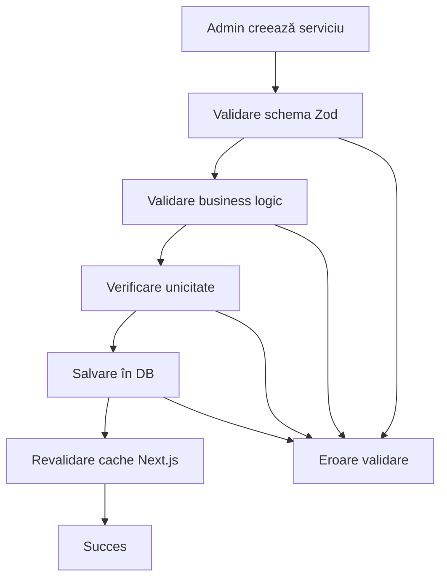

# Domeniul Services

Domeniul `services` gestionează serviciile oferite de salon, permițând administratorilor să definească și să gestioneze oferta de servicii disponibile pentru clienți.

## 🎯 Business Case

Fiecare salon oferă o gamă variată de servicii care pot fi organizate pe categorii:

- **Tunsori**: Servicii de tunsori pentru toate tipurile de păr
- **Vopsit**: Servicii de vopsit și colorare profesională
- **Coafat**: Servicii de coafat și styling pentru ocazii speciale
- **Tratamente**: Tratamente pentru păr și scalp
- **Altele**: Alte servicii specializate

## 📋 Funcționalitate

### Pentru Administratori

- ✅ Pot vedea toate serviciile din sistem
- ✅ Pot adăuga noi servicii
- ✅ Pot edita serviciile existente
- ✅ Pot șterge serviciile
- ✅ Pot activa/dezactiva serviciile
- ✅ Pot filtra serviciile după categorie

### Pentru Stylists

- ✅ Pot vedea serviciile active
- ✅ Pot vedea serviciile după categorie
- ✅ Pot accesa detaliile serviciilor

## 🗂️ Structura Fișierelor

```
src/core/domains/services/
├── service.types.ts          # Tipuri TypeScript + interfaces
├── service.constants.ts      # Constante + enum-uri + mesaje
├── service.validators.ts     # Validatori Zod + helpers
├── service.repository.ts     # Acces la baza de date (Drizzle)
├── service.service.ts        # Business logic
├── index.ts                  # Export centralizat
└── README.md                 # Documentația domeniului

src/features/services/
└── actions.ts                # Server Actions (Next.js)

src/db/schema/
└── services.ts               # Schema Drizzle pentru DB
```

## 🗄️ Schema Bazei de Date

```sql
CREATE TABLE services (
  id UUID PRIMARY KEY DEFAULT gen_random_uuid(),
  name VARCHAR(100) NOT NULL,
  description TEXT,
  price DECIMAL(10,2) NOT NULL,
  duration INTEGER NOT NULL,
  category service_category NOT NULL,
  is_active BOOLEAN NOT NULL DEFAULT true,
  created_at TIMESTAMPTZ NOT NULL DEFAULT NOW(),
  updated_at TIMESTAMPTZ NOT NULL DEFAULT NOW()
);

CREATE TYPE service_category AS ENUM (
  'haircut',
  'coloring',
  'styling',
  'treatment',
  'other'
);
```

## 🔧 Utilizare

### 1. Import

```typescript
import {
  createServiceService,
  createServiceRepository,
  type CreateServiceData,
  SERVICE_CATEGORIES,
} from '@/core/domains/services'
```

### 2. Creare Service (cu DI)

```typescript
import { db } from '@/db'

const serviceService = createServiceService(createServiceRepository(db))
```

### 3. Server Actions

```typescript
import {
  createServiceAction,
  updateServiceAction,
  deleteServiceAction,
  getServicesAction,
} from '@/features/services/actions'
```

### 4. Validare cu Zod

```typescript
import { CreateServiceFormValidator, validateServiceData, formatValidationErrors } from '@/core/domains/services'

const result = CreateServiceFormValidator.safeParse(formData)
if (!result.success) {
  const errors = formatValidationErrors(result.error)
  // Handle errors
}
```

## 📝 Exemple de Utilizare

### Crearea unui Serviciu

```typescript
const newService: CreateServiceData = {
  name: 'Tunsori pentru femei',
  description: 'Tunsori moderne pentru toate tipurile de păr',
  price: '150.00',
  duration: 60,
  category: 'haircut',
  isActive: true,
}

const result = await serviceService.createService(newService)
```

### Actualizarea unui Serviciu

```typescript
const updateData: UpdateServiceData = {
  id: 'uuid-service',
  name: 'Tunsori pentru femei - Premium',
  price: '180.00',
  duration: 75,
}

const result = await serviceService.updateService(updateData)
```

### Filtrarea Serviciilor

```typescript
const filters: ServiceFilters = {
  category: 'haircut',
  isActive: true,
  search: 'tunsori',
}

const services = await serviceService.getServicesByCategory('haircut')
```

## 🛡️ Validări Implementate

### 1. Validări de Bază

- ✅ **Nume**: 3-100 caractere, obligatoriu
- ✅ **Preț**: Pozitiv, între 0.01 și 10000 RON
- ✅ **Durată**: Întreg pozitiv, între 1 și 480 minute
- ✅ **Categorie**: Unul din enum-urile valide
- ✅ **Descriere**: Maxim 500 caractere

### 2. Validări de Business

- ✅ **Unicitate**: Nu se pot crea servicii cu același nume
- ✅ **Existență**: Verificare existență înainte de update/delete
- ✅ **Status**: Serviciile pot fi activate/dezactivate

### 3. Validări de UI

- ✅ **Formate**: Validare pentru input-uri de formular
- ✅ **Transformări**: Conversie automată string → number pentru preț/durată
- ✅ **Mesaje**: Erori descriptive și user-friendly

## 🎨 Categorii de Servicii

| Categorie   | Eticheta   | Descriere                                            |
| ----------- | ---------- | ---------------------------------------------------- |
| `haircut`   | Tunsori    | Servicii de tunsori pentru toate tipurile de păr     |
| `coloring`  | Vopsit     | Servicii de vopsit și colorare profesională          |
| `styling`   | Coafat     | Servicii de coafat și styling pentru ocazii speciale |
| `treatment` | Tratamente | Tratamente pentru păr și scalp                       |
| `other`     | Altele     | Alte servicii specializate                           |

## 🔄 Workflow



## 🚨 Gestionarea Erorilor

Toate erorile sunt centralizate în constante:

```typescript
import { SERVICE_ERROR_MESSAGES } from '@/core/domains/services'

// Exemple de mesaje
SERVICE_ERROR_MESSAGES.NOT_FOUND // "Serviciul nu a fost găsit în sistem"
SERVICE_ERROR_MESSAGES.ALREADY_EXISTS // "Un serviciu cu acest nume există deja"
SERVICE_ERROR_MESSAGES.CREATE_FAILED // "Crearea serviciului a eșuat"
```

## 🔐 Securitate

Implementează **4 straturi de securitate** conform arhitecturii:

1. **Middleware**: Verifică autentificarea
2. **Layout**: Verifică rolurile la nivel de layout
3. **Page**: Double-check la nivel de pagină
4. **Server Actions**: Validare finală în actions

```typescript
// Exemplu în server actions
export const createServiceAction = async (payload) => {
  const { user } = await ensureUserIsAdmin() // Layer 4 security

  // Validare și business logic
  const result = await serviceService.createService(payload)

  return result
}
```

## 📚 Referințe

- **Arhitectură generală**: Consultă `.cursorrules` pentru principiile arhitecturale
- **Dependency Injection**: Pattern implementat în service și repository
- **Clean Architecture**: Separarea clară între layere (Domain → Service → Actions)
- **Type Safety**: TypeScript strict, fără `any`
