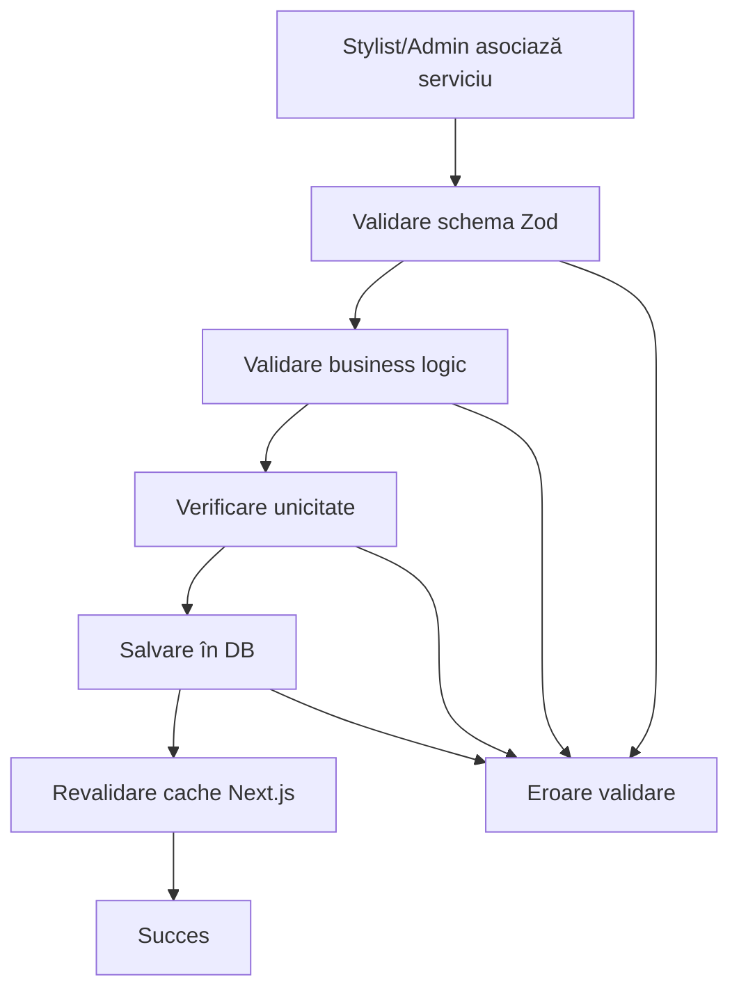

# Domeniul Stylist Services

Domeniul `stylist-services` gestionează asocierea serviciilor cu stiliștii din aplicația de salon, permițând fiecărui stilist să-și personalizeze prețurile și duratele pentru serviciile oferite.

## 🎯 Business Case

Fiecare stilist poate asocia servicii cu propriile prețuri și durate personalizate:

- **Asocierea serviciilor** cu stiliștii
- **Prețuri personalizate** pentru fiecare stilist
- **Durate personalizate** pentru fiecare stilist
- **Validare unicitate** pentru a evita duplicatele
- **Autorizare** bazată pe stilist

## 📋 Funcționalitate

### Pentru Stylists

- ✅ Pot vedea serviciile asociate cu propriile prețuri
- ✅ Pot adăuga noi servicii la lista lor
- ✅ Pot edita prețurile și duratele personalizate
- ✅ Pot șterge serviciile din lista lor
- ✅ Pot vedea serviciile cu prețuri standard și personalizate

### Pentru Administratori

- ✅ Pot gestiona toate asociările serviciu-stilist
- ✅ Pot vedea toate serviciile în sistem
- ✅ Au acces complet la toate operațiunile CRUD
- ✅ Pot verifica serviciile oferite de fiecare stilist

## 🗂️ Structura Fișierelor

```
src/core/domains/stylist-services/
├── stylist-service.types.ts          # Tipuri TypeScript + interfaces
├── stylist-service.constants.ts      # Constante + enum-uri + mesaje
├── stylist-service.validators.ts     # Validatori Zod + helpers
├── stylist-service.repository.ts     # Acces la baza de date (Drizzle)
├── stylist-service.service.ts        # Business logic
├── index.ts                          # Export centralizat
└── README.md                         # Documentația domeniului

src/features/stylist-services/
└── actions.ts                        # Server Actions (Next.js)

src/db/schema/
└── stylist-services.ts               # Schema Drizzle pentru DB
```

## 🗄️ Schema Bazei de Date

```sql
CREATE TABLE stylists_to_services (
  id UUID PRIMARY KEY DEFAULT gen_random_uuid(),
  stylist_id UUID NOT NULL REFERENCES stylists(id) ON DELETE CASCADE,
  service_id UUID NOT NULL REFERENCES services(id) ON DELETE CASCADE,
  custom_price DECIMAL(10,2),
  custom_duration INTEGER,
  created_at TIMESTAMPTZ NOT NULL DEFAULT NOW(),
  updated_at TIMESTAMPTZ NOT NULL DEFAULT NOW(),

  -- Constraint pentru unicitate
  CONSTRAINT unique_stylist_service UNIQUE (stylist_id, service_id)
);
```

## 🔧 Utilizare

### 1. Import

```typescript
import {
  createStylistServiceLinkService,
  createStylistServiceLinkRepository,
  type CreateStylistServiceLinkPayload,
  STYLIST_SERVICE_LINK_MESSAGES,
} from '@/core/domains/stylist-services'
```

### 2. Creare Service (cu DI)

```typescript
import { db } from '@/db'

const stylistServiceLinkService = createStylistServiceLinkService(createStylistServiceLinkRepository(db))
```

### 3. Server Actions

```typescript
// Pentru administratori
import {
  createStylistServiceLinkAdminAction,
  updateStylistServiceLinkAdminAction,
  deleteStylistServiceLinkAdminAction,
  getStylistServiceLinksAdminAction,
} from '@/features/stylist-services/actions'

// Pentru stylists
import {
  createStylistServiceLinkStylistAction,
  updateStylistServiceLinkStylistAction,
  deleteStylistServiceLinkStylistAction,
  getStylistServiceLinksStylistAction,
} from '@/features/stylist-services/actions'
```

### 4. Validare cu Zod

```typescript
import {
  CreateStylistServiceLinkFormValidator,
  validateStylistServiceData,
  formatValidationErrors,
} from '@/core/domains/stylist-services'

const result = CreateStylistServiceLinkFormValidator.safeParse(formData)
if (!result.success) {
  const errors = formatValidationErrors(result.error)
  // Handle errors
}
```

## 📝 Exemple de Utilizare

### Crearea unei Asociări Serviciu-Stylist

```typescript
const newLink: CreateStylistServiceLinkPayload = {
  stylistId: 'uuid-stylist',
  serviceId: 'uuid-service',
  customPrice: '150.00',
  customDuration: 90,
}

const result = await stylistServiceLinkService.createLink(newLink)
```

### Actualizarea Prețului Personalizat

```typescript
const updateData: UpdateStylistServiceLinkPayload = {
  stylistId: 'uuid-stylist',
  serviceId: 'uuid-service',
  customPrice: '180.00',
  customDuration: 120,
}

const result = await stylistServiceLinkService.updateLink(updateData.stylistId, updateData.serviceId, updateData)
```

### Obținerea Serviciilor unui Stylist

```typescript
const stylistServices = await stylistServiceLinkService.getLinksByStylistId('uuid-stylist')

// Rezultat:
// [
//   {
//     id: '...',
//     stylistId: 'uuid-stylist',
//     serviceId: 'uuid-service',
//     customPrice: '150.00',
//     customDuration: 90,
//     service: { name: 'Tuns', category: 'Coafură', ... }
//   }
// ]
```

## 🛡️ Validări Implementate

### 1. Validări de Bază

- ✅ **ID Stylist**: UUID valid și obligatoriu
- ✅ **ID Service**: UUID valid și obligatoriu
- ✅ **Preț personalizat**: Format valid și pozitiv
- ✅ **Durată personalizată**: Număr întreg pozitiv

### 2. Validări de Business

- ✅ **Verificare unicitate**: Nu se permite aceeași asociere stylist-service
- ✅ **Autorizare**: Stylists pot modifica doar propriile servicii
- ✅ **Validare preț**: Prețul personalizat trebuie să fie pozitiv
- ✅ **Validare durată**: Durata personalizată trebuie să fie pozitivă

### 3. Validări de Performanță

- ✅ **Indexare**: Indexuri pe `stylist_id` și `service_id`
- ✅ **Caching**: Cache pentru serviciile frecvent accesate
- ✅ **Optimizare**: Queries optimizate pentru verificarea unicității

## 🎨 Tipuri de Prețuri

| Tip Preț         | Descriere                                   |
| ---------------- | ------------------------------------------- |
| **Standard**     | Prețul din catalogul general al serviciului |
| **Personalizat** | Prețul specific stilistului pentru serviciu |

## 🔄 Workflow



## 🚨 Gestionarea Erorilor

Toate erorile sunt centralizate în constante:

```typescript
import { STYLIST_SERVICE_LINK_MESSAGES } from '@/core/domains/stylist-services'

// Exemple de mesaje
STYLIST_SERVICE_LINK_MESSAGES.ERROR.NOT_FOUND // "Legătura stilist-serviciu nu a fost găsită"
STYLIST_SERVICE_LINK_MESSAGES.ERROR.ALREADY_EXISTS // "Această legătură există deja"
STYLIST_SERVICE_LINK_MESSAGES.ERROR.UNAUTHORIZED_ACCESS // "Acces neautorizat la gestionarea serviciilor stilistului"
STYLIST_SERVICE_LINK_MESSAGES.SUCCESS.CREATED // "Legătura stilist-serviciu a fost creată cu succes"
```

## 🔐 Securitate

Implementează **4 straturi de securitate** conform arhitecturii:

1. **Middleware**: Verifică autentificarea
2. **Layout**: Verifică rolurile la nivel de layout
3. **Page**: Double-check la nivel de pagină
4. **Server Actions**: Validare finală în actions

```typescript
// Exemplu în server actions
export const createStylistServiceLinkStylistAction = async (payload) => {
  const { user } = await ensureUserIsStylist() // Layer 4 security

  // Enforțăm că stylistul poate crea doar pentru sine
  const actionPayload = { ...payload, stylistId: user.id }

  // ... rest of logic
}
```

## 📚 Referințe

- **Arhitectură generală**: Consultă `.cursorrules` pentru principiile arhitecturale
- **Dependency Injection**: Pattern implementat în service și repository
- **Clean Architecture**: Separarea clară între layere (Domain → Service → Actions)
- **Type Safety**: TypeScript strict, fără `any`
- **Validare**: Zod pentru validarea datelor cu mesaje descriptive
