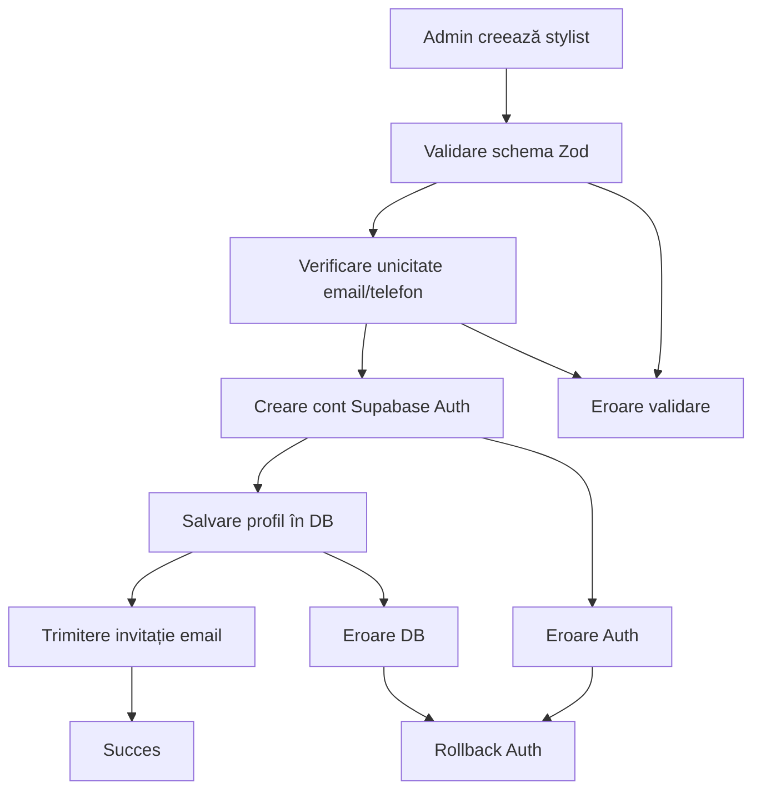

# Domeniul Stylists

Domeniul `stylists` gestionează echipa de stiliști și cosmetologi din aplicația de salon, permițând gestionarea completă a profilurilor și autentificării acestora.

## 🎯 Business Case

Fiecare salon are nevoie de o echipă de stiliști și cosmetologi care să deservească clienții. Acest domeniu gestionează:

- **Profilurile stiliștilor** cu informații personale și profesionale
- **Autentificarea stiliștilor** prin invitații pe email
- **Gestionarea stării active/inactive** a stiliștilor
- **Integrarea cu Supabase Auth** pentru securitate

## 📋 Funcționalitate

### Pentru Administratori

- ✅ Pot vedea toți stilișții din salon
- ✅ Pot adăuga noi stiliști prin invitații pe email
- ✅ Pot edita profilurile stiliștilor
- ✅ Pot șterge stiliști din sistem
- ✅ Pot activa/dezactiva stiliști

### Pentru Stylists

- ✅ Pot vedea propriul profil
- ✅ Pot edita propriile informații
- ✅ Pot accesa sistemul prin invitația primită

## 🗂️ Structura Fișierelor

```
src/core/domains/stylists/
├── stylist.types.ts          # Tipuri TypeScript + interfaces
├── stylist.constants.ts      # Constante + mesaje + limitări
├── stylist.validators.ts     # Validatori Zod + helpers
├── stylist.repository.ts     # Acces la baza de date (Drizzle)
├── stylist.service.ts        # Business logic
├── index.ts                  # Export centralizat
└── README.md                 # Documentația domeniului

src/features/stylists/
└── actions.ts                # Server Actions (Next.js)

src/db/schema/
└── stylists.ts               # Schema Drizzle pentru DB
```

## 🗄️ Schema Bazei de Date

```sql
CREATE TABLE stylists (
  id UUID PRIMARY KEY DEFAULT gen_random_uuid(),
  full_name VARCHAR(100) NOT NULL,
  email VARCHAR(255) NOT NULL UNIQUE,
  phone VARCHAR(15) NOT NULL,
  description TEXT,
  is_active BOOLEAN NOT NULL DEFAULT true,
  created_at TIMESTAMPTZ NOT NULL DEFAULT NOW(),
  updated_at TIMESTAMPTZ NOT NULL DEFAULT NOW()
);

-- Indexuri pentru performanță
CREATE INDEX idx_stylists_email ON stylists(email);
CREATE INDEX idx_stylists_phone ON stylists(phone);
CREATE INDEX idx_stylists_active ON stylists(is_active);
```

## 🔧 Utilizare

### 1. Import

```typescript
import {
  createStylistService,
  createStylistRepository,
  type CreateStylistData,
  STYLIST_MESSAGES,
} from '@/core/domains/stylists'
```

### 2. Creare Service (cu DI)

```typescript
import { db } from '@/db'
import { supabaseAdmin } from '@/lib/supabase'

const stylistService = createStylistService(createStylistRepository(db), supabaseAdmin)
```

### 3. Server Actions

```typescript
import {
  createStylistAction,
  updateStylistAction,
  deleteStylistAction,
  getStylistsAction,
} from '@/features/stylists/actions'
```

### 4. Validare cu Zod

```typescript
import { StylistFormValidator, validateStylistData, formatValidationErrors } from '@/core/domains/stylists'

const result = StylistFormValidator.safeParse(formData)
if (!result.success) {
  const errors = formatValidationErrors(result.error)
  // Handle errors
}
```

## 📝 Exemple de Utilizare

### Crearea unui Stylist

```typescript
const newStylist: CreateStylistData = {
  fullName: 'Maria Popescu',
  email: 'maria.popescu@salon.com',
  phone: '0722123456',
  description: 'Specialist în coafuri de mireasă',
  isActive: true,
}

const result = await stylistService.createStylist(newStylist)
// Rezultat: { success: true, message: 'Stilistul a fost invitat...', data: stylist }
```

### Actualizarea unui Stylist

```typescript
const updateData: UpdateStylistData = {
  id: 'uuid-stylist',
  fullName: 'Maria Popescu-Constantinescu',
  phone: '0722123457',
  description: 'Specialist în coafuri de mireasă și machiaj',
}

const result = await stylistService.updateStylist(updateData)
```

### Obținerea Listei de Stiliști

```typescript
const stylists = await stylistService.getAllStylists()

// Filtrare după status
const activeStylists = stylists.filter((stylist) => stylist.isActive)
```

## 🛡️ Validări Implementate

### 1. Validări de Bază

- ✅ **Nume complet**: Minim 3 caractere, obligatoriu
- ✅ **Email**: Format valid, unic în sistem
- ✅ **Telefon**: Minim 9 caractere, unic în sistem
- ✅ **Descriere**: Opțional, maxim 500 caractere

### 2. Validări de Business

- ✅ **Unicitate email**: Nu se pot crea doi stiliști cu același email
- ✅ **Unicitate telefon**: Nu se pot crea doi stiliști cu același telefon
- ✅ **Autorizare**: Doar administratorii pot gestiona stiliștii

### 3. Validări de Securitate

- ✅ **UUID valid**: ID-urile trebuie să fie UUID-uri valide
- ✅ **Sanitizare input**: Toate input-urile sunt trim-uite și validate
- ✅ **Integrare Supabase**: Autentificarea se face prin Supabase Auth

## 🔄 Workflow de Creare Stylist



## 🚨 Gestionarea Erorilor

Toate erorile sunt centralizate în constante:

```typescript
import { STYLIST_ERROR_MESSAGES } from '@/core/domains/stylists'

// Exemple de mesaje
STYLIST_ERROR_MESSAGES.NOT_FOUND // "Stilistul nu a fost găsit în sistem"
STYLIST_ERROR_MESSAGES.CREATE_AUTH_ERROR // "Eroare la crearea contului de autentificare"
STYLIST_ERROR_MESSAGES.UNAUTHORIZED // "Nu aveți permisiunea să accesați..."
STYLIST_ERROR_MESSAGES.EMAIL_ALREADY_EXISTS // "Această adresă de email este deja folosită"
```

## 🔐 Securitate

Implementează **4 straturi de securitate** conform arhitecturii:

1. **Middleware**: Verifică autentificarea
2. **Layout**: Verifică rolurile la nivel de layout
3. **Page**: Double-check la nivel de pagină
4. **Server Actions**: Validare finală în actions

```typescript
// Exemplu în server actions
export const createStylistAction = async (payload) => {
  const { user } = await ensureUserIsAdmin() // Layer 4 security

  // Validare și business logic
  const result = await stylistService.createStylist(payload)

  // ... rest of logic
}
```

## 🔄 Integrare cu Supabase Auth

Domeniul se integrează cu Supabase Auth pentru:

- **Invitații pe email**: Stiliștii primesc invitații pentru a-și crea contul
- **Autentificare securizată**: Folosește Supabase Auth pentru securitate
- **Rollback automat**: Dacă profilul nu se salvează, contul Auth este șters

```typescript
// În service.ts
const {
  data: { user },
  error,
} = await supabaseAdmin.auth.admin.inviteUserByEmail(payload.email, { redirectTo: APP_ROUTES.AUTH_CONFIRM })

if (error || !user) {
  throw new DatabaseError(STYLIST_ERROR_MESSAGES.CREATE_AUTH_ERROR)
}
```

## 📚 Referințe

- **Arhitectură generală**: Consultă `.cursorrules` pentru principiile arhitecturale
- **Dependency Injection**: Pattern implementat în service și repository
- **Clean Architecture**: Separarea clară între layere (Domain → Service → Actions)
- **Type Safety**: TypeScript strict, fără `any`
- **Validare**: Zod pentru validarea datelor cu mesaje descriptive
- **Supabase Auth**: Integrare pentru autentificare securizată
