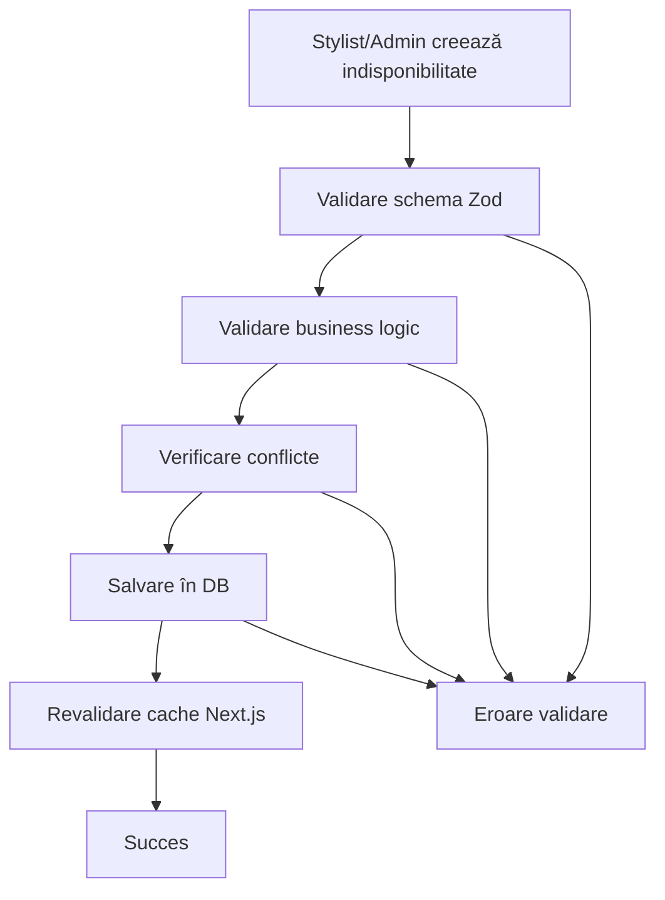

# Domeniul Unavailability

Domeniul `unavailability` gestionează indisponibilitățile pentru fiecare stylist din aplicația de salon, permițând excluderea acestor intervale din logica de booking.

## 🎯 Business Case

Fiecare stylist își poate defini intervale de indisponibilitate, care pot include:

- **Pauze** peste programul normal
- **Programări offline** (în afara salonului)
- **Situații excepționale** sau neprevăzute
- **Zile întregi** indisponibile

## 📋 Funcționalitate

### Pentru Stylists

- ✅ Pot vedea propriile indisponibilități
- ✅ Pot adăuga noi intervale de indisponibilitate
- ✅ Pot edita intervalele existente
- ✅ Pot șterge intervalele proprii

### Pentru Administratori

- ✅ Pot gestiona indisponibilitatea tuturor stiliștilor
- ✅ Pot vedea toate intervalele în sistem
- ✅ Au acces complet la toate operațiunile CRUD

## 🗂️ Structura Fișierelor

```
src/core/domains/unavailability/
├── unavailability.types.ts          # Tipuri TypeScript + interfaces
├── unavailability.constants.ts      # Constante + enum-uri + mesaje
├── unavailability.validators.ts     # Validatori Zod + helpers
├── unavailability.repository.ts     # Acces la baza de date (Drizzle)
├── unavailability.service.ts        # Business logic
├── index.ts                         # Export centralizat
└── README.md                        # Documentația domeniului

src/features/unavailability/
└── actions.ts                       # Server Actions (Next.js)

src/db/schema/
└── unavailabilities.ts              # Schema Drizzle pentru DB
```

## 🗄️ Schema Bazei de Date

```sql
CREATE TABLE unavailabilities (
  id UUID PRIMARY KEY DEFAULT gen_random_uuid(),
  stylist_id UUID NOT NULL REFERENCES stylists(id) ON DELETE CASCADE,
  date DATE NOT NULL,
  start_time TIME,
  end_time TIME,
  cause unavailability_cause NOT NULL,
  all_day BOOLEAN NOT NULL DEFAULT false,
  description TEXT,
  created_at TIMESTAMPTZ NOT NULL DEFAULT NOW(),
  updated_at TIMESTAMPTZ NOT NULL DEFAULT NOW()
);

CREATE TYPE unavailability_cause AS ENUM (
  'pauza',
  'programare_offline',
  'alta_situatie'
);
```

## 🔧 Utilizare

### 1. Import

```typescript
import {
  createUnavailabilityService,
  createUnavailabilityRepository,
  type CreateUnavailabilityData,
  UNAVAILABILITY_CAUSES,
} from '@/core/domains/unavailability'
```

### 2. Creare Service (cu DI)

```typescript
import { db } from '@/db'

const unavailabilityService = createUnavailabilityService(createUnavailabilityRepository(db))
```

### 3. Server Actions

```typescript
// Pentru administratori
import {
  createUnavailabilityAdminAction,
  updateUnavailabilityAdminAction,
  deleteUnavailabilityAdminAction,
  getUnavailabilitiesAdminAction,
} from '@/features/unavailability/actions'

// Pentru stylists
import {
  createUnavailabilityStylistAction,
  updateUnavailabilityStylistAction,
  deleteUnavailabilityStylistAction,
  getUnavailabilitiesStylistAction,
} from '@/features/unavailability/actions'
```

### 4. Validare cu Zod

```typescript
import {
  CreateUnavailabilityFormValidator,
  validateTimeRange,
  formatValidationErrors,
} from '@/core/domains/unavailability'

const result = CreateUnavailabilityFormValidator.safeParse(formData)
if (!result.success) {
  const errors = formatValidationErrors(result.error)
  // Handle errors
}
```

## 📝 Exemple de Utilizare

### Crearea unei Indisponibilități

```typescript
const newUnavailability: CreateUnavailabilityData = {
  stylistId: 'uuid-stylist',
  date: '2024-03-15',
  startTime: '14:00',
  endTime: '16:00',
  cause: 'pauza',
  allDay: false,
  description: 'Pauză de prânz extinsă',
}

const result = await unavailabilityService.createUnavailability(newUnavailability)
```

### Indisponibilitate Toată Ziua

```typescript
const dayOffUnavailability: CreateUnavailabilityData = {
  stylistId: 'uuid-stylist',
  date: '2024-03-20',
  startTime: null,
  endTime: null,
  cause: 'alta_situatie',
  allDay: true,
  description: 'Concediu medical',
}
```

### Filtrarea Indisponibilităților

```typescript
const filters: UnavailabilityFilters = {
  stylistId: 'uuid-stylist',
  dateFrom: '2024-03-01',
  dateTo: '2024-03-31',
  cause: 'pauza',
}

const unavailabilities = await unavailabilityService.getUnavailabilitiesByFilters(filters)
```

## 🛡️ Validări Implementate

### 1. Validări de Bază

- ✅ **ID Stylist**: UUID valid și obligatoriu
- ✅ **Dată**: Format valid (YYYY-MM-DD) și nu în trecut
- ✅ **Cauza**: Unul din enum-urile valide
- ✅ **Descriere**: Maxim 500 caractere

### 2. Validări Condiționate

- ✅ **Timp obligatoriu**: Dacă `allDay = false`, atunci `startTime` și `endTime` sunt obligatorii
- ✅ **Ordine timp**: `endTime` > `startTime`
- ✅ **Durata minimă**: Minim 15 minute pentru intervale

### 3. Validări de Business

- ✅ **Verificare conflicte**: Nu se suprapun intervalele pentru același stylist
- ✅ **Autorizare**: Stylists pot modifica doar propriile indisponibilități

## 🎨 Tipuri de Cauze

| Cauză                | Eticheta           | Descriere                                 |
| -------------------- | ------------------ | ----------------------------------------- |
| `pauza`              | Pauză              | Pauză planificată peste programul normal  |
| `programare_offline` | Programare offline | Programare care nu se desfășoară la salon |
| `alta_situatie`      | Altă situație      | Situație excepțională sau neprevăzută     |

## 🔄 Workflow



## 🚨 Gestionarea Erorilor

Toate erorile sunt centralizate în constante:

```typescript
import { UNAVAILABILITY_ERROR_MESSAGES } from '@/core/domains/unavailability'

// Exemple de mesaje
UNAVAILABILITY_ERROR_MESSAGES.NOT_FOUND // "Indisponibilitatea nu a fost găsită"
UNAVAILABILITY_ERROR_MESSAGES.CREATION_FAILED // "Crearea indisponibilității a eșuat"
UNAVAILABILITY_ERROR_MESSAGES.UNAUTHORIZED // "Nu aveți permisiunea..."
UNAVAILABILITY_ERROR_MESSAGES.CONFLICT_EXISTS // "Există deja o indisponibilitate..."
```

## 🔐 Securitate

Implementează **4 straturi de securitate** conform arhitecturii:

1. **Middleware**: Verifică autentificarea
2. **Layout**: Verifică rolurile la nivel de layout
3. **Page**: Double-check la nivel de pagină
4. **Server Actions**: Validare finală în actions

```typescript
// Exemplu în server actions
export const createUnavailabilityStylistAction = async (payload) => {
  const { user } = await ensureUserIsStylist() // Layer 4 security

  // Enforțăm că stylistul poate crea doar pentru sine
  const actionPayload = { ...payload, stylistId: user.id }

  // ... rest of logic
}
```

## 📚 Referințe

- **Arhitectură generală**: Consultă `.cursorrules` pentru principiile arhitecturale
- **Dependency Injection**: Pattern implementat în service și repository
- **Clean Architecture**: Separarea clară între layere (Domain → Service → Actions)
- **Type Safety**: TypeScript strict, fără `any`
