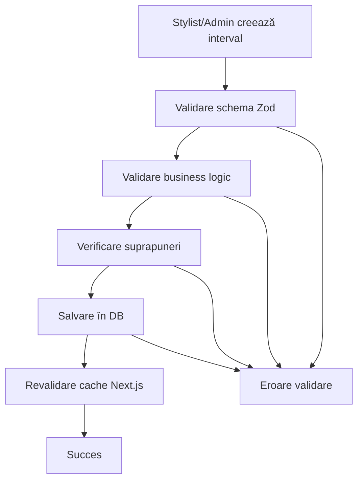

# Domeniul Work Schedule

Domeniul `work-schedule` gestionează programele de lucru pentru fiecare stylist din aplicația de salon, permițând definirea intervalelor de lucru pentru fiecare zi a săptămânii.

## 🎯 Business Case

Fiecare stylist își poate defini programul de lucru săptămânal, care include:

- **Intervale de lucru** pentru fiecare zi a săptămânii
- **Ore de început și sfârșit** pentru fiecare interval
- **Validare automată** pentru a evita suprapunerile
- **Flexibilitate** în programare (mai multe intervale pe zi)

## 📋 Funcționalitate

### Pentru Stylists

- ✅ Pot vedea propriul program de lucru organizat pe zile
- ✅ Pot adăuga noi intervale de lucru
- ✅ Pot edita intervalele existente
- ✅ Pot șterge intervalele proprii
- ✅ Pot configura mai multe intervale pe aceeași zi

### Pentru Administratori

- ✅ Pot gestiona programele tuturor stiliștilor
- ✅ Pot vedea toate intervalele în sistem
- ✅ Au acces complet la toate operațiunile CRUD
- ✅ Pot verifica disponibilitatea stiliștilor

## 🗂️ Structura Fișierelor

```
src/core/domains/work-schedule/
├── workSchedule.types.ts          # Tipuri TypeScript + interfaces
├── workSchedule.constants.ts      # Constante + enum-uri + mesaje
├── workSchedule.validators.ts     # Validatori Zod + helpers
├── workSchedule.repository.ts     # Acces la baza de date (Drizzle)
├── workSchedule.service.ts        # Business logic
├── index.ts                       # Export centralizat
└── README.md                      # Documentația domeniului

src/features/work-schedule/
└── actions.ts                     # Server Actions (Next.js)

src/db/schema/
└── work-schedules.ts              # Schema Drizzle pentru DB
```

## 🗄️ Schema Bazei de Date

```sql
CREATE TABLE work_schedules (
  id UUID PRIMARY KEY DEFAULT gen_random_uuid(),
  stylist_id UUID NOT NULL REFERENCES stylists(id) ON DELETE CASCADE,
  day_of_week INTEGER NOT NULL CHECK (day_of_week >= 0 AND day_of_week <= 6),
  start_time TIME NOT NULL,
  end_time TIME NOT NULL,
  created_at TIMESTAMPTZ NOT NULL DEFAULT NOW(),
  updated_at TIMESTAMPTZ NOT NULL DEFAULT NOW(),

  -- Constraint pentru a evita suprapunerile
  CONSTRAINT no_overlap_same_day UNIQUE (stylist_id, day_of_week, start_time, end_time)
);
```

## 🔧 Utilizare

### 1. Import

```typescript
import {
  createWorkScheduleService,
  createWorkScheduleRepository,
  type CreateWorkScheduleData,
  DAYS_OF_WEEK,
  DAY_NAMES,
} from '@/core/domains/work-schedule'
```

### 2. Creare Service (cu DI)

```typescript
import { db } from '@/db'

const workScheduleService = createWorkScheduleService(createWorkScheduleRepository(db))
```

### 3. Server Actions

```typescript
// Pentru administratori
import {
  createWorkScheduleAdminAction,
  updateWorkScheduleAdminAction,
  deleteWorkScheduleAdminAction,
  getWorkSchedulesAdminAction,
} from '@/features/work-schedule/actions'

// Pentru stylists
import {
  createWorkScheduleStylistAction,
  updateWorkScheduleStylistAction,
  deleteWorkScheduleStylistAction,
  getWorkSchedulesStylistAction,
} from '@/features/work-schedule/actions'
```

### 4. Validare cu Zod

```typescript
import {
  CreateWorkScheduleFormValidator,
  validateTimeRange,
  formatValidationErrors,
} from '@/core/domains/work-schedule'

const result = CreateWorkScheduleFormValidator.safeParse(formData)
if (!result.success) {
  const errors = formatValidationErrors(result.error)
  // Handle errors
}
```

## 📝 Exemple de Utilizare

### Crearea unui Interval de Program

```typescript
const newSchedule: CreateWorkScheduleData = {
  stylistId: 'uuid-stylist',
  dayOfWeek: 1, // Marți
  startTime: '09:00',
  endTime: '17:00',
}

const result = await workScheduleService.createSchedule(newSchedule)
```

### Program cu Intervale Multiple

```typescript
// Dimineața
const morningSchedule: CreateWorkScheduleData = {
  stylistId: 'uuid-stylist',
  dayOfWeek: 2, // Miercuri
  startTime: '09:00',
  endTime: '12:00',
}

// După-amiaza
const afternoonSchedule: CreateWorkScheduleData = {
  stylistId: 'uuid-stylist',
  dayOfWeek: 2, // Miercuri
  startTime: '14:00',
  endTime: '18:00',
}
```

### Obținerea Programului Săptămânal

```typescript
const weeklySchedule = await workScheduleService.getStylistSchedule('uuid-stylist')

// Rezultat:
// {
//   stylistId: 'uuid-stylist',
//   schedule: {
//     1: [{ id: '...', dayOfWeek: 1, startTime: '09:00', endTime: '17:00' }],
//     2: [
//       { id: '...', dayOfWeek: 2, startTime: '09:00', endTime: '12:00' },
//       { id: '...', dayOfWeek: 2, startTime: '14:00', endTime: '18:00' }
//     ],
//     // ... restul zilelor
//   }
// }
```

## 🛡️ Validări Implementate

### 1. Validări de Bază

- ✅ **ID Stylist**: UUID valid și obligatoriu
- ✅ **Ziua săptămânii**: Între 0 (Luni) și 6 (Duminică)
- ✅ **Format timp**: HH:MM valid (00:00 - 23:59)
- ✅ **Ordine timp**: `endTime` > `startTime`

### 2. Validări de Business

- ✅ **Verificare suprapuneri**: Nu se suprapun intervalele pentru același stylist în aceeași zi
- ✅ **Autorizare**: Stylists pot modifica doar propriile programe
- ✅ **Flexibilitate**: Permite mai multe intervale pe aceeași zi

### 3. Validări de Performanță

- ✅ **Indexare**: Indexuri pe `stylist_id` și `day_of_week`
- ✅ **Caching**: Cache pentru programele frecvent accesate
- ✅ **Optimizare**: Queries optimizate pentru verificarea suprapunerilor

## 🎨 Zilele Săptămânii

| Cod | Nume     | Descriere                |
| --- | -------- | ------------------------ |
| 0   | Luni     | Prima zi a săptămânii    |
| 1   | Marți    | A doua zi a săptămânii   |
| 2   | Miercuri | A treia zi a săptămânii  |
| 3   | Joi      | A patra zi a săptămânii  |
| 4   | Vineri   | A cincea zi a săptămânii |
| 5   | Sâmbătă  | A șasea zi a săptămânii  |
| 6   | Duminică | A șaptea zi a săptămânii |

## 🔄 Workflow



## 🚨 Gestionarea Erorilor

Toate erorile sunt centralizate în constante:

```typescript
import { WORK_SCHEDULE_MESSAGES } from '@/core/domains/work-schedule'

// Exemple de mesaje
WORK_SCHEDULE_MESSAGES.ERROR.NOT_FOUND // "Intervalul de program nu a fost găsit"
WORK_SCHEDULE_MESSAGES.ERROR.CREATE_FAILED // "Nu s-a putut crea intervalul de program"
WORK_SCHEDULE_MESSAGES.ERROR.OVERLAP_EXISTS // "Există deja un interval în această perioadă"
WORK_SCHEDULE_MESSAGES.ERROR.UNAUTHORIZED_MODIFY // "Nu aveți permisiunea să modificați programul altor stiliști"
```

## 🔐 Securitate

Implementează **4 straturi de securitate** conform arhitecturii:

1. **Middleware**: Verifică autentificarea
2. **Layout**: Verifică rolurile la nivel de layout
3. **Page**: Double-check la nivel de pagină
4. **Server Actions**: Validare finală în actions

```typescript
// Exemplu în server actions
export const createWorkScheduleStylistAction = async (payload) => {
  const { user } = await ensureUserIsStylist() // Layer 4 security

  // Enforțăm că stylistul poate crea doar pentru sine
  const actionPayload = { ...payload, stylistId: user.id }

  // ... rest of logic
}
```

## 📚 Referințe

- **Arhitectură generală**: Consultă `.cursorrules` pentru principiile arhitecturale
- **Dependency Injection**: Pattern implementat în service și repository
- **Clean Architecture**: Separarea clară între layere (Domain → Service → Actions)
- **Type Safety**: TypeScript strict, fără `any`
- **Validare**: Zod pentru validarea datelor cu mesaje descriptive
